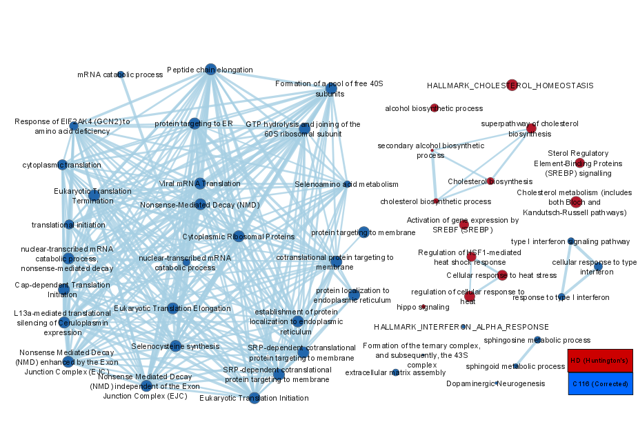
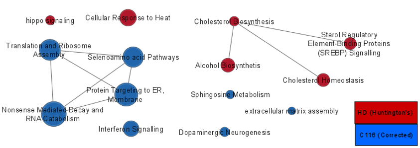

### Introduction

## A1 Recap
The data used was retrieved from GSE74201 and represents bulk RNA-seq data from iPSCs and NSCs that either contain the Huntington’s disease causing CAG repeat(HD) or have had this repeat removed(C116). The papers “Genomic Analysis Reveals Disruption of Striatal Neuronal Development and Therapeutic Targets in Human Huntington’s Disease Neural Stem Cells” by Ring et al. (2015) and “Altered Expression of Matrix Metalloproteinases and Their Endogenous Inhibitors in a Human Isogenic Stem Cell Model of Huntington’s Disease” by Naphade et al.(2017) are associated with this accesion.

Data cleaning and normalization in A1 resulted in a reduction from 22506 genes to 14864 genes. There were no duplicates after removing all genes with less than 1cpm, before checking updating symbols. After normalization, PCA/MDS analysis showed a substantial difference between iPSC samples and NSC samples, with large separation between healthy and diseased NSC cells but not between iPSC cells.

## A2 Recap
Differential expression analysis was done using edgeR. DE analysis was performed between the iPSC treatments with and without Huntington's disease seperately from the NSC treatments. There were 2203 differentially expressed genes between the NSC treatment samples based on p value, and 1108 based on FDR. For the iPSC treatments, there were 371 DE genes based on p value, and 77 based on FDR. ORA performed with the gprofiler2 R package showed 43 pathways (with less than 300 members) significantly over-represented for all iPSC DE genes, and 254 significantly over represented pathways for all DE NSC genes. Genes were considered to be upregulated (positive FC) if they had increased expression in the Huntington's disease(HD) samples 

### Non-thresholded Gene set Enrichment Analysis

```{r}
#load data from the previous assignment
nsc_file <- "NSC_DE_results.txt"
ipsc_file <- "iPSC_DE_results.txt"
nsc_exists <- file.exists(nsc_file)
ipsc_exists <- file.exists(ipsc_file)
if (nsc_exists & ipsc_exists) {
  NSC_DE_data <- read.table(nsc_file, header = TRUE, sep = "\t")
  iPSC_DE_data <- read.table(ipsc_file, header = TRUE, sep = "\t")
}
```


First we will generate the ranked file. The ranks will be based on the magnitude of the p value and the sign of the log FC. We multiply by negative 1 since the log of the p-value will be negative

```{r}
gsea_dir <- "/home/rstudio/GSEA_4.1.0/"
gsea_exists <- dir.exists(gsea_dir)
if (nsc_exists & ipsc_exists) {
  # get ranks for NSC data
  NSC_DE_data$rank <- -1*log(NSC_DE_data$PValue, base = 10)*sign(NSC_DE_data$logFC)
  iPSC_DE_data$rank <- -1*log(iPSC_DE_data$PValue, base = 10)*sign(iPSC_DE_data$logFC)
  
  NSC_DE_data <- NSC_DE_data[order(NSC_DE_data$rank, decreasing = TRUE), ]
  iPSC_DE_data <- iPSC_DE_data[order(iPSC_DE_data$rank, decreasing = TRUE), ]
  
  if (gsea_exists) {
    write.table(data.frame(rownames(NSC_DE_data), NSC_DE_data$rank), "/home/rstudio/GSEA_4.1.0/nsc_rank.rnk", row.names = FALSE, col.names = TRUE, quote = FALSE, sep = "\t")
    write.table(data.frame(rownames(iPSC_DE_data), iPSC_DE_data$rank), "/home/rstudio/GSEA_4.1.0/ipsc_rank.rnk", row.names = FALSE, col.names = TRUE, quote = FALSE, sep = "\t")
  } else {
    write.table(data.frame(rownames(NSC_DE_data), NSC_DE_data$rank), "nsc_rank.rnk", row.names = FALSE, col.names = TRUE, quote = FALSE, sep = "\t")
    write.table(data.frame(rownames(iPSC_DE_data), iPSC_DE_data$rank), x =  "ipsc_rank.rnk", row.names = FALSE, col.names = TRUE, quote = FALSE, sep = "\t")
  }
}
```


```{r}
#load necessary packages
tryCatch(expr = { library("RCurl")}, 
         error = function(e) {  install.packages("RCurl")}, 
         finally = library("RCurl"))
tryCatch(expr = { library("BiocManager")}, 
         error = function(e) { 
           install.packages("BiocManager")}, 
         finally = library("BiocManager"))
tryCatch(expr = { library("ggplot2")}, 
         error = function(e) { install.packages("ggplot2")}, 
         finally = library("ggplot2"))
tryCatch(expr = { library("RCy3")}, 
         error = function(e) { BiocManager::install("RCy3")}, 
         finally = library("RCy3"))
```

I will use GSEA 4.1.0 to perform Non-thresholded Gene set Enrichment Analysis with gene set permutation. I am using gene set permutation because I wanted to create the ranked list myself rather than have GSEA assemble it for me and compare it to a scrambled list. The Bader lab geneset was used which uses genesets from GO, reactome, wikipathways, PANTHER, Msigdb, NetPath, NCI Nature, Humaneye, and others.

```{r}
if (nsc_exists & ipsc_exists & gsea_exists){
  gmt_url <- "http://download.baderlab.org/EM_Genesets/current_release/Human/symbol/"
  # list all the files on the server
  filenames <- getURL(gmt_url)
  tc <- textConnection(filenames)
  contents <- readLines(tc)
  close(tc)
  # get the annotation file
  rx <- gregexpr("(?<=<a href=\")(.*.GOBP_AllPathways_no_GO_iea.*.)(.gmt)(?=\">)", contents, 
                perl = TRUE)
  gmt_file <- unlist(regmatches(contents, rx))
  dest_gmt_file <- gmt_file
  download.file(paste(gmt_url, gmt_file, sep = ""), destfile = dest_gmt_file)
  
  #execute GSEA from within R
  command_nsc <- paste("", "/home/rstudio/GSEA_4.1.0/gsea-cli.sh",  "GSEAPreRanked -gmx", dest_gmt_file, "-rnk" ,"/home/rstudio/GSEA_4.1.0/nsc_rank.rnk", "-collapse false -nperm 1000 -scoring_scheme weighted -rpt_label ","HD_vs_C116_NSC","  -plot_top_x 20 -rnd_seed 12345  -set_max 200 -set_min 15 -zip_report false -out" ,"/home/rstudio/GSEA_4.1.0/", " > gsea_output.txt",sep=" ")
  system(command_nsc)
  
  command_ipsc <- paste("", "/home/rstudio/GSEA_4.1.0/gsea-cli.sh",  "GSEAPreRanked -gmx", dest_gmt_file, "-rnk" ,"/home/rstudio/GSEA_4.1.0/ipsc_rank.rnk", "-collapse false -nperm 1000 -scoring_scheme weighted -rpt_label ","HD_vs_C116_iPSC","  -plot_top_x 20 -rnd_seed 12345  -set_max 200 -set_min 15 -zip_report false -out" ,"/home/rstudio/GSEA_4.1.0/", " > gsea_output.txt",sep=" ")
  system(command_ipsc)
}
```

  For the NSC samples, the results using a ranked list with GSEA seem to be fairly similar to the results using thresholded lists with gprofiler2. Pathways related to cholesterol homeostasis score are shown as highly enriched for DE genes upregulated in the Huntington's disease samples with both methods.Similarly, pathways related to protein targeting to membranes are enriched among the down-regulated genes in the NSC Huntington's disease samples.
  
  For the iPSC samples, the results were also fairly similar to the results in A2, with cholesterol related pathways being among the most significantly upregulated pathways in the Huntington's disease samples, and endoderm developement related pathways downregulated in the Huntington's disease(HD) samples.

  In general, the comparison between the the ranked list results and the thresholded list is fairly straightforward, though the enriched pathways often do not have the exact same name even if they are similar because different genesets were used for the different analyses. 


### Cytoscape Visualization

For this portion, I will only examine the NSC samples, since the iPSC were always expected to have a smaller number of deferentially expressed genes compared to the NSC samples.

I will use an FDR and p-value cutoff of 0.05 and only Jaccard for the similarity coefficient with a cutoff of 0.548. I will also scale the node size based on the FDR value rather than based on geneset size for the full network(but not for the theme network), with larger nodes having smaller FDR values.


The layout was modified to be a bit more readable by starting with the circular layout and then moving nodes so that no text was overlapping. A legend indicating the meaning of the node colouration was added.





We can see here that the main themes appear to be Cholesterol related pathways for the pathways upregulated in corrected samples, and Translation regulation as well as protein targeting to ER for the Pathways upregulated in the Huntington's disease samples. This is similar to what was seen with the GSEA. Protein targeting to the ER is somewhat related to the cholesterol pathways even thought they don't have many genes in common since cholesterol and other lipids are synthesized in the ER.

### Interpretation and Further Analysis

  The results when using GSEA with a ranked list were fairly similar to the results when using gprofiler with a thresholded lists, though the pathways are not all exactly the same because the genesets used were slightly different. There appears to be a large number of pathways related to the endoplasmic reticulum that are differentially expressed, as many of the lipid related pathways may be dysregulated due to issues with the ER of NSCs with Huntington's disease.

While all the disease causing mechanisms of Huntington's disease are not fully understood, it has long been known that Huntington's disease impairs proper translation through the formation of aggregates of misfolded HTT protein(McColgan & Tabrizi, 2017). One of the papers associated with the dataset used (Naphade et al., 2018) investigated the differences in expression of Matrix metalloproteinase(MMP) genes. MMPs are secreted proteins that degrade extracellular matrix proteins(Miller et al., 2010). Because of this association, I will examine the differential expression of genes in the extracellular matrix assembly pathway. The figure below shows the expression levels of genes in this pathway.

![In the above figure, the genes associated with the Extracellular Matrix assembly pathway are shown. The node size indicate the p-value for the node, with larger nodes having smaller p-values. Nodes that are more blue have decreased expression in Huntington's disease samples, and nodes that are more red have increased expression in Huntington's disease samples. The orange edge represents a physical protein-protein interaction, the blue edges represent co-localization, and the purple edges represent co-expression](./figures/ECM.Network.png)


### References 

McColgan, P., &amp; Tabrizi, S. J. (2017). Huntington's disease: A Clinical review. European Journal of Neurology, 25(1), 24-34. doi:10.1111/ene.13413

Naphade, S., Embusch, A., Madushani, K. L., Ring, K. L., &amp; Ellerby, L. M. (2018). Altered expression of matrix metalloproteinases and their endogenous inhibitors in a human isogenic stem cell model of huntington's disease. Frontiers in Neuroscience, 11. doi:10.3389/fnins.2017.00736

Ring, K., An, M., Zhang, N., O’Brien, R., Ramos, E., Gao, F., . . . Ellerby, L. (2015). Genomic analysis reveals disruption of striatal neuronal development and therapeutic targets in human huntington’s disease neural stem cells. Stem Cell Reports, 5(6), 1023-1038. doi:10.1016/j.stemcr.2015.11.005

Shannon, P. (2003). Cytoscape: A software environment for Integrated models of biomolecular Interaction Networks. Genome Research, 13(11), 2498-2504. doi:10.1101/gr.1239303

Subramanian, A., Tamayo, P., Mootha, V. K., Mukherjee, S., Ebert, B. L., Gillette, M. A., . . . Mesirov, J. P. (2005). Gene set enrichment analysis: A knowledge-based approach for interpreting genome-wide expression profiles. Proceedings of the National Academy of Sciences, 102(43), 15545-15550. doi:10.1073/pnas.0506580102

Miller, J. P., Holcomb, J., Al-Ramahi, I., De Haro, M., Gafni, J., Zhang, N., . . . Ellerby, L. M. (2010). Matrix Metalloproteinases are modifiers OF Huntingtin Proteolysis and toxicity in Huntington's disease. Neuron, 67(2), 199-212. doi:10.1016/j.neuron.2010.06.021


